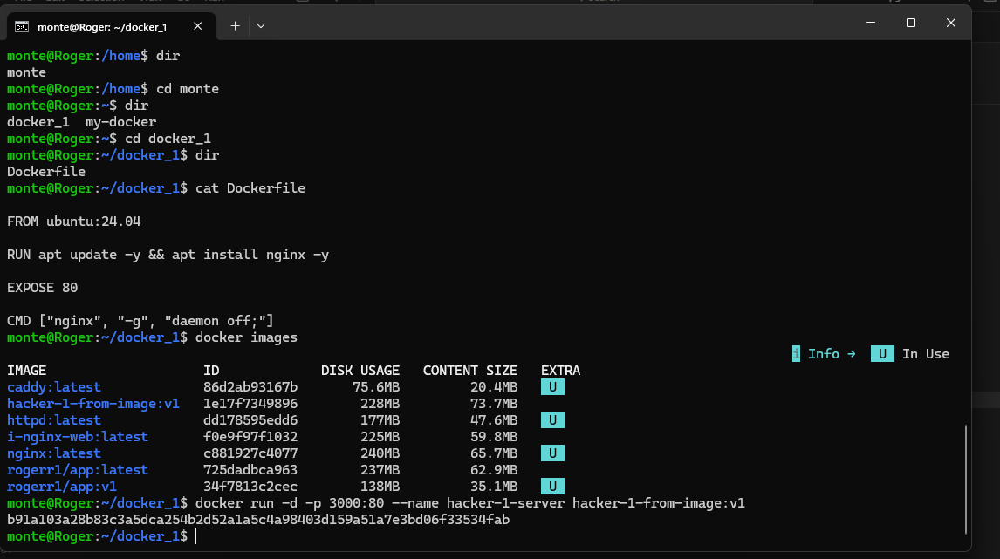
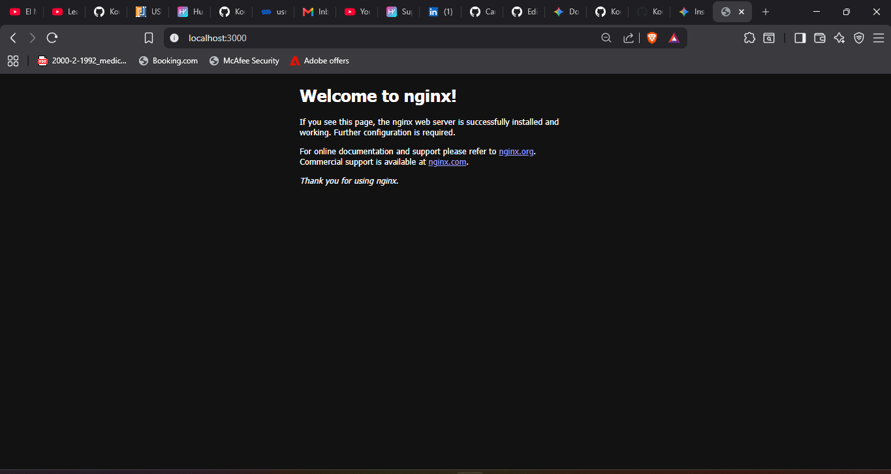

# SOCIAL OPLESK
### 🏴‍☠️ HACKS 
<br/>

## ⚡️ Hack Docker ⚡️

<br />
<br />


**Requisitos previos**
<br/>
- instalar docker engine, enlace:  https://docs.docker.com/engine/install/

```diff
- NOTA HACER LAS PRÁCTICAS MEDIANTE LA CONSOLA - TERMINAL  
- Debes tener docker engine en wsl en caso de emplear windows, ideal sobre debian / ubuntu / fedora.
```
|Hacks | Details | 
|----------|---------|
| H-1      | image óptima |
| H-2      | APT correcto |
| H-3      | no root | 
<br/> 

## 🏆 H-1 (aplicar la image óptima)

```

📁docker_1/
├── Dockerfile

```

1. Crear un directorio llamado docker_1

2. Dentro del directorio docker_1 crear el archivo Dockerfile

3. Debes crear el Dockerfile sin elegir un FROM de image incorrecto
   
4. las versiones slim siempre se deben seleccionar sobre una version latest
   
```
❌ Mal
FROM ubuntu:latest

---

✅ Bien
FROM ubuntu:24.04
```

<br/>
🟢 Script Dockerfile del hack-1 a resolver 🟢


```

FROM ❓

RUN apt update -y && apt install nginx -y

EXPOSE 80

CMD ["nginx", "-g", "daemon off;"]

```
⚡RUN . . . 🚀
```
docker build -t hacker-1-from-image .

docker images 

docker run -d -p 3000:80 --name hacker-1-server hacker-1-from-image:v1
```

# Solucion H1
<br />





<br />

## 🏆 H-2 (usar apt con el estilo correcto en docker)

```

📁docker_2/
├── Dockerfile

```

1. Crear un directorio llamado docker_2

2. Dentro del directorio docker_2 crear el archivo Dockerfile

3. Debes crear el Dockerfile con una image de ubuntu correcta e instalar nginx. 
   
4. apt está diseñado para humanos: Es un comando interactivo para la terminal del día a día.<br/> 
   apt-get está diseñado para scripts y automatización: Es una herramienta de "bajo nivel" mucho más estable y predecible.
   
5. apt-get clean: borra los archivos .deb descargados que ya se instalaron.

6. --no-install-recommends y --no-install-suggests:<br/>
   Estas banderas le dicen: "Instala solo lo estrictamente necesario para que curl funcione".<br/>
   Esto te puede ahorrar cientos de megabytes de basura.

7. rm -rf /var/lib/apt/lists/* <br/>
   Elimina los índices de los repositorios (las listas de qué paquetes existen).    

   
```
❌ Mal (crea 3 capas)
RUN apt update
RUN apt install -y curl

✅ Bien (1 sola capa)
RUN apt-get update -y && \
    apt-get install -y --no-install-recommends --no-install-suggests curl && \
    apt-get clean && \
    rm -rf /var/lib/apt/lists/*
```

<br/>
🟢 Script Dockerfile del hack-2 a resolver 🟢

```

FROM ❓

RUN ❓

EXPOSE 80

CMD ["nginx", "-g", "daemon off;"]

```
⚡RUN . . . 🚀
```
docker build -t hacker-2-apt:v1 .

docker images

docker run -d -p 5000:80 --name hacker-2-server hacker-2-apt:v1
```

<br />
<br />

## 🏆 H-3 (Usuario no root)

```

📁docker_3/
├── Dockerfile
├── requirements.txt
├── app.py

```


1. Crear un directorio llamado docker_3

2. Dentro del directorio docker_3 crear el archivo Dockerfile

3. pip install --no-cache-dir -r: es la bandera que le dice a pip: <br/>
 "Descarga el paquete, instálalo y borra inmediatamente el archivo descargado; no me dejes basura en la carpeta de caché".

4. al finalizar verifica que todo funciona aplicando estos pasos:
```
 Consulta la API al tner el contenedor listo
  http://localhost:8080/app adicional

 Verificar el usuario no root, luego de tener el contenedor listo
 mediante la temrinal: docker exec mi-container whoami
# Respuesta: appuser (no root)
```

5. Debes crear el archivo requirements.txt e internamente debe tener: flask==2.3.3
```
flask==2.3.3
```

6. Siempre evitar tener el server modo debug en el Dockerfile
```
# ❌ debug=True activado en un script de Flask dentro de Docker <br/>
     (especialmente si va a producción) es uno de los errores más peligrosos y comunes.
     ⚡ app.run(host='0.0.0.0', port=PORT, debug=True)


# ✅ debug=False es importante (foreground, no recarga automática)
# ✅ debug=False es obligatorio en Docker.
     ⚡ app.run(host='0.0.0.0', port=PORT, debug=False)
```

7. Ejemplo de como utilizar en Dockerfile el modo no root
```

# ✅ Crea y usa usuario no root
RUN useradd -m -u 1000 appuser
USER appuser

# Cambiar al usuario no root
USER appuser

WORKDIR /home/appuser/app

---

# ✅ Crea y usa usuario no root
RUN useradd -m -u 1000 appuser && \
    chown -R appuser:appuser /app

# Cambiar al usuario no root
USER appuser
```

8. Script de la aplicación flask que vas a emplear para el hack.
```
import os
from flask import Flask

app = Flask(__name__)

@app.route('/')
def hello():
    return f"¡Hola desde flask corriendo en Docker!"

@app.route('/app')
def health():
    return {"status": "ok", "app": "flask app"}

if __name__ == '__main__':
    app.run(host='0.0.0.0', port=8080, debug=❓)
```

<br/>
🟢 Script de Dockerfile del hack-3 a resolver 🟢

```

FROM python:3.9-slim

WORKDIR /app

COPY requirements.txt .

RUN pip install ❓

RUN useradd ❓

USER ❓

EXPOSE 8080

CMD ["python", "app.py"]

```

⚡RUN . . . 🚀
```
docker build -t hacker-3-no-root:v1 .

docker images

docker run -d -p 8080:8080 --name hacker-3-server hacker-3-no-root:v1
```


---
<h3 align="center">SOCIAL OPLESK</h3>

